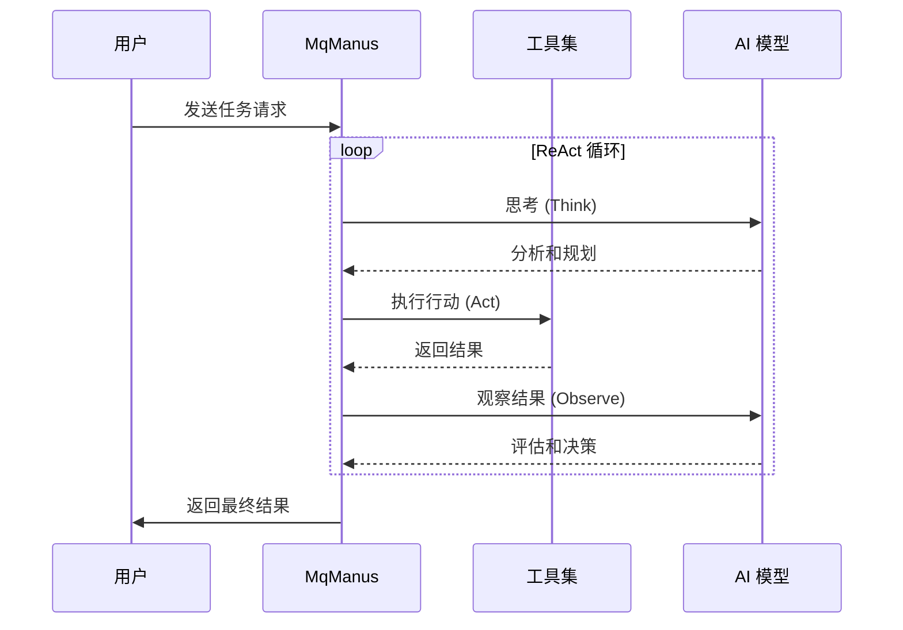

# 🤖 MQ AI Agent

<div align="center">


**🚀 基于 Spring AI 的智能健身助手和多功能 AI 智能体平台**

[English](README_EN.md) | [演示视频](#) | [在线体验](#) | [API 文档](#)

</div>

## 📖 项目简介

MQ AI Agent 是一个基于 **Spring AI** 框架构建的现代化 AI 智能体平台，专注于提供智能健身指导和多功能 AI 服务。项目集成了阿里云通义千问大模型，支持 **ReAct 模式**的智能体架构，具备工具调用、RAG 知识库问答、对话记忆等核心功能。

### ✨ 核心特性

- 🏃‍♂️ **智能健身助手 (KeepApp)**: 专业的 AI 健身教练，提供个性化训练方案
- 🤖 **多功能智能体 (MqManus)**: 支持工具调用的通用 AI 助手
- 🧠 **对话记忆系统**: 基于 MySQL 的持久化对话历史管理
- 🔧 **丰富工具生态**: 文件操作、网络搜索、PDF 生成等多种工具
- 📚 **RAG 知识库**: 集成阿里云知识库服务，提供专业健身知识
- 🔐 **用户权限管理**: 完整的用户认证和权限控制系统
- 🌊 **流式响应**: 支持 SSE 实时流式对话体验

## 🏗️ 系统架构

### 整体架构图


## 🚀 快速开始

### 环境要求

- **Java**: 21+
- **Maven**: 3.8+
- **MySQL**: 8.0+
- **Redis**: 6.0+ (可选)

### 安装步骤

1. **克隆项目**
```bash
git clone https://github.com/lmqvq/mq-ai-agent.git
cd mq-ai-agent
```

2. **配置数据库**
```bash
# 创建数据库
mysql -u root -p < sql/create_table.sql
```

3. **配置应用**
```yaml
# src/main/resources/application.yml
spring:
  datasource:
    url: jdbc:mysql://localhost:3306/mq_ai_agent
    username: your_username
    password: your_password
  
  ai:
    dashscope:
      api-key: your_dashscope_api_key

search-api:
  api-key: your_search_api_key
```

4. **启动应用**
```bash
mvn spring-boot:run
```

5. **访问应用**
- API 文档: http://localhost:8123/api/swagger-ui.html
- 健康检查: http://localhost:8123/api/actuator/health

## 📚 API 使用指南

### 健身助手 API

```bash
# 同步对话
curl -X GET "http://localhost:8123/api/ai/keep_app/chat/sync" \
  -d "message=我想增肌，请给我建议" \
  -d "chatId=chat_123"

# 流式对话（支持用户认证）
curl -X GET "http://localhost:8123/api/ai/keep_app/chat/sse/user" \
  -H "Cookie: JSESSIONID=your_session_id" \
  -d "message=制定一周健身计划" \
  -d "chatId=chat_456"
```

### 智能体 API

```bash
# MqManus 智能体（支持工具调用）
curl -X GET "http://localhost:8123/api/ai/manus/chat/user" \
  -H "Cookie: JSESSIONID=your_session_id" \
  -d "message=帮我搜索最新的健身资讯并生成PDF报告" \
  -d "chatId=chat_789"
```

### 历史对话 API

```bash
# 获取对话列表
curl -X GET "http://localhost:8123/api/chat/history/list" \
  -H "Cookie: JSESSIONID=your_session_id"

# 获取对话详情
curl -X GET "http://localhost:8123/api/chat/history/detail?chatId=chat_123" \
  -H "Cookie: JSESSIONID=your_session_id"
```

## 🛠️ 技术栈

### 后端技术
- **框架**: Spring Boot 3.4.6, Spring AI
- **AI 模型**: 阿里云通义千问 (DashScope)
- **数据库**: MySQL 8.0, MyBatis-Plus
- **缓存**: Redis (可选)
- **工具**: Hutool, Lombok, FastJSON2

### AI 能力
- **对话模型**: 通义千问系列模型
- **知识库**: 阿里云知识库服务
- **工具调用**: 文件操作、网络搜索、PDF生成等
- **记忆管理**: 基于数据库的持久化对话记忆

## 🔧 配置说明

### 核心配置项

```yaml
# AI 模型配置
spring:
  ai:
    dashscope:
      api-key: ${DASHSCOPE_API_KEY}
      chat:
        options:
          model: qwen-plus
          temperature: 0.7

# 搜索 API 配置
search-api:
  api-key: ${SEARCH_API_KEY}

# 文件上传配置
cos:
  client:
    accessKey: ${COS_ACCESS_KEY}
    secretKey: ${COS_SECRET_KEY}
    region: ${COS_REGION}
    bucket: ${COS_BUCKET}
```

### 环境变量

创建 `.env` 文件：
```bash
DASHSCOPE_API_KEY=your_dashscope_api_key
SEARCH_API_KEY=your_search_api_key
COS_ACCESS_KEY=your_cos_access_key
COS_SECRET_KEY=your_cos_secret_key
COS_REGION=your_cos_region
COS_BUCKET=your_cos_bucket
```

## 📁 项目结构

```
mq-ai-agent/
├── src/main/java/com/mq/mqaiagent/
│   ├── agent/              # 智能体核心
│   │   ├── BaseAgent.java
│   │   ├── ReActAgent.java
│   │   ├── ToolCallAgent.java
│   │   └── MqManus.java
│   ├── app/                # 应用服务
│   │   └── KeepApp.java
│   ├── chatmemory/         # 对话记忆
│   │   └── DatabaseChatMemory.java
│   ├── controller/         # 控制器
│   │   ├── AiController.java
│   │   ├── ChatHistoryController.java
│   │   └── UserController.java
│   ├── service/            # 业务服务
│   ├── tools/              # 工具集合
│   ├── rag/                # RAG 配置
│   └── config/             # 配置类
├── sql/                    # 数据库脚本
└── README.md

## 🎯 功能特性详解

### 🏃‍♂️ 智能健身助手 (KeepApp)

KeepApp 是专门为健身爱好者设计的 AI 助手，具备以下能力：

- **个性化训练方案**: 根据用户身体状况、健身目标制定专属计划
- **营养指导**: 提供科学的饮食建议和营养搭配
- **动作指导**: 详细的健身动作说明和注意事项
- **进度跟踪**: 记录和分析用户的健身进展
- **RAG 知识库**: 基于专业健身知识库的问答服务

**使用示例**:
```java
// 基础对话
String response = keepApp.doChat("我想增肌，请给我建议", "chat_123");

// 流式对话
Flux<String> stream = keepApp.doChatByStream("制定一周训练计划", "chat_456", userId);

// RAG 知识库问答
String ragResponse = keepApp.doChatWithRag("深蹲的正确姿势", "chat_789");
```

### 🤖 多功能智能体 (MqManus)

MqManus 是基于 ReAct 架构的通用智能体，支持复杂任务的自动化执行：

#### 🔧 内置工具集

| 工具类别 | 工具名称 | 功能描述 |
|---------|---------|---------|
| 文件操作 | FileOperationTool | 文件读写、目录管理 |
| 网络搜索 | WebSearchTool | 网络信息搜索 |
| 网页抓取 | WebCrawlingTool | 网页内容提取 |
| 资源下载 | ResourceDownloadTool | 文件下载管理 |
| PDF 生成 | PDFGenerationTool | 文档生成和转换 |
| 任务终止 | TerminateTool | 智能体任务控制 |

#### 🧠 ReAct 工作流程



### 💾 对话记忆系统

基于 MySQL 的持久化对话记忆，支持：

- **用户隔离**: 每个用户的对话记录完全隔离
- **多轮对话**: 支持长期对话上下文记忆
- **历史查询**: 完整的对话历史管理
- **性能优化**: 智能的记忆检索和存储策略

```java
// 对话记忆配置
DatabaseChatMemory chatMemory = new DatabaseChatMemory(keepReportMapper);
chatMemory.setCurrentUserId(userId);

// 自动保存和检索对话历史
chatMemory.add(conversationId, messages);
List<Message> history = chatMemory.get(conversationId, 10);
```

## 🔐 安全特性

### 用户认证与授权

- **Session 管理**: 基于 Spring Session 的用户会话管理
- **权限控制**: 细粒度的 API 访问权限控制
- **数据隔离**: 用户数据完全隔离，确保隐私安全

### API 安全

- **请求验证**: 完整的请求参数验证
- **异常处理**: 统一的异常处理和错误响应
- **日志审计**: 详细的操作日志记录

## 📊 性能优化

### 数据库优化

- **索引策略**: 针对查询模式优化的数据库索引
- **连接池**: HikariCP 高性能数据库连接池
- **查询优化**: MyBatis-Plus 的高效 ORM 操作

### 缓存策略

- **对话缓存**: Redis 缓存热点对话数据
- **用户缓存**: 用户信息和权限缓存
- **工具结果缓存**: 工具调用结果的智能缓存

### 流式响应

- **SSE 支持**: Server-Sent Events 实时数据推送
- **背压处理**: Reactor 响应式流的背压控制
- **资源管理**: 自动的连接和资源清理

## 🧪 测试

### 运行测试

```bash
# 运行所有测试
mvn test

# 运行特定测试类
mvn test -Dtest=AiControllerTest

# 生成测试报告
mvn surefire-report:report
```

### 测试覆盖率

```bash
# 生成覆盖率报告
mvn jacoco:report

# 查看报告
open target/site/jacoco/index.html
```

## 📈 监控与运维

### 健康检查

```bash
# 应用健康状态
curl http://localhost:8123/actuator/health

# 详细健康信息
curl http://localhost:8123/actuator/health/detailed
```

### 指标监控

```bash
# 应用指标
curl http://localhost:8123/actuator/metrics

# JVM 信息
curl http://localhost:8123/actuator/metrics/jvm.memory.used
```

### 日志管理

```yaml
# logback-spring.xml 配置
logging:
  level:
    com.mq.mqaiagent: DEBUG
    org.springframework.ai: INFO
  pattern:
    file: "%d{yyyy-MM-dd HH:mm:ss} [%thread] %-5level %logger{36} - %msg%n"
```

## 🚀 部署指南

### Docker 部署

```dockerfile
# Dockerfile
FROM openjdk:21-jdk-slim

WORKDIR /app
COPY target/mq-ai-agent-0.0.1-SNAPSHOT.jar app.jar

EXPOSE 8123
ENTRYPOINT ["java", "-jar", "app.jar"]
```

```bash
# 构建镜像
docker build -t mq-ai-agent:latest .

# 运行容器
docker run -d -p 8123:8123 \
  -e DASHSCOPE_API_KEY=your_api_key \
  -e MYSQL_URL=jdbc:mysql://host:3306/db \
  mq-ai-agent:latest
```

### Docker Compose

```yaml
# docker-compose.yml
version: '3.8'
services:
  app:
    build: .
    ports:
      - "8123:8123"
    environment:
      - DASHSCOPE_API_KEY=${DASHSCOPE_API_KEY}
      - MYSQL_URL=jdbc:mysql://mysql:3306/mq_ai_agent
    depends_on:
      - mysql
      - redis

  mysql:
    image: mysql:8.0
    environment:
      MYSQL_ROOT_PASSWORD: password
      MYSQL_DATABASE: mq_ai_agent
    volumes:
      - mysql_data:/var/lib/mysql
      - ./sql:/docker-entrypoint-initdb.d

  redis:
    image: redis:7-alpine
    ports:
      - "6379:6379"

volumes:
  mysql_data:
```

## 🤝 贡献指南

我们欢迎所有形式的贡献！请查看 [CONTRIBUTING.md](CONTRIBUTING.md) 了解详细信息。

### 开发流程

1. Fork 项目
2. 创建特性分支 (`git checkout -b feature/AmazingFeature`)
3. 提交更改 (`git commit -m 'Add some AmazingFeature'`)
4. 推送到分支 (`git push origin feature/AmazingFeature`)
5. 创建 Pull Request

### 代码规范

- 遵循 [Google Java Style Guide](https://google.github.io/styleguide/javaguide.html)
- 使用 Lombok 减少样板代码
- 编写完整的 JavaDoc 注释
- 保持测试覆盖率 > 80%

## 📄 许可证

本项目采用 MIT 许可证 - 查看 [LICENSE](LICENSE) 文件了解详情。

## 🙏 致谢

- [Spring AI](https://spring.io/projects/spring-ai) - 强大的 AI 应用开发框架
- [阿里云通义千问](https://dashscope.aliyun.com/) - 优秀的大语言模型服务
- [Spring Boot](https://spring.io/projects/spring-boot) - 快速应用开发框架

## 📞 联系我们

- **作者**: LMQICU
- **邮箱**: 2097489731@qq.com
- **项目主页**: https://github.com/lmqvq/mq-ai-agent
- **问题反馈**: https://github.com/lmqvq/mq-ai-agent/issues

---

<div align="center">

**⭐ 如果这个项目对你有帮助，请给我们一个 Star！⭐**

Made with ❤️ by [LMQICU](https://github.com/lmqvq)

</div>
```
