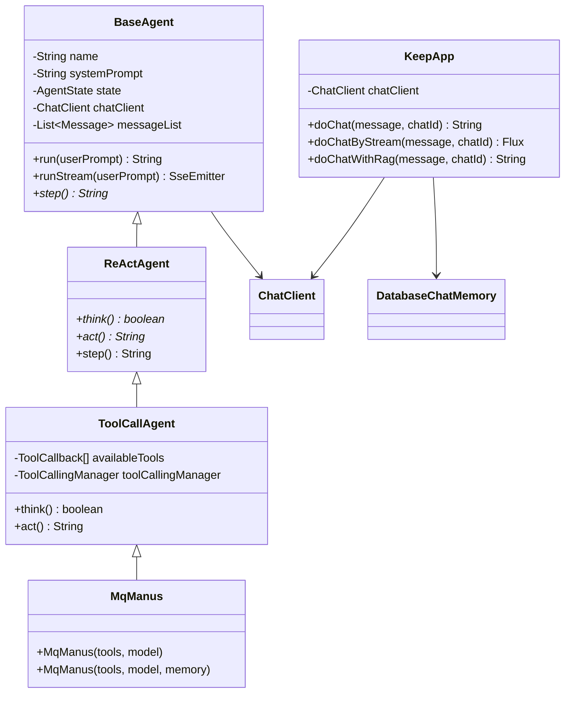

# 🤖 MQ AI Agent

<div align="center">


**🚀 Intelligent Fitness Assistant and Multi-functional AI Agent Platform based on Spring AI**

[中文](README.md) | [Demo Video](#) | [Live Demo](#) | [API Docs](#)

</div>

## 📖 Project Overview

MQ AI Agent is a modern AI agent platform built on the **Spring AI** framework, focusing on intelligent fitness guidance and multi-functional AI services. The project integrates Alibaba Cloud's Qwen large language model and supports **ReAct pattern** agent architecture with core features including tool calling, RAG knowledge base Q&A, and conversation memory.

### ✨ Key Features

- 🏃‍♂️ **Intelligent Fitness Assistant (KeepApp)**: Professional AI fitness coach providing personalized training plans
- 🤖 **Multi-functional Agent (MqManus)**: Universal AI assistant supporting tool calling
- 🧠 **Conversation Memory System**: MySQL-based persistent conversation history management
- 🔧 **Rich Tool Ecosystem**: File operations, web search, PDF generation, and more
- 📚 **RAG Knowledge Base**: Integrated with Alibaba Cloud knowledge base service for professional fitness knowledge
- 🔐 **User Permission Management**: Complete user authentication and access control system
- 🌊 **Streaming Response**: SSE real-time streaming conversation experience

## 🏗️ System Architecture

### Overall Architecture

The system adopts a layered architecture design, from bottom to top:

1. **Data Storage Layer**: MySQL, Redis, File Storage, Knowledge Base
2. **AI Capability Layer**: Spring AI Framework, Qwen Model, RAG, Memory Management
3. **Agent Architecture Layer**: BaseAgent, ReActAgent, ToolCallAgent, Tool Ecosystem
4. **Business Service Layer**: AI Application Services, Core Business Services
5. **Controller Layer**: AI Controller, Chat History Controller, User Controller
6. **Gateway Layer**: Spring Boot Web, Authentication, CORS, Rate Limiting
7. **Client Layer**: Web Frontend, Mobile, Third-party API

### Agent Architecture Design



## 🚀 Quick Start

### Prerequisites

- **Java**: 21+
- **Maven**: 3.8+
- **MySQL**: 8.0+
- **Redis**: 6.0+ (Optional)

### Installation Steps

1. **Clone the Repository**
```bash
git clone https://github.com/lmqvq/mq-ai-agent.git
cd mq-ai-agent
```

2. **Setup Database**
```bash
# Create database
mysql -u root -p < sql/create_table.sql
```

3. **Configure Application**
```yaml
# src/main/resources/application.yml
spring:
  datasource:
    url: jdbc:mysql://localhost:3306/mq_ai_agent
    username: your_username
    password: your_password
  
  ai:
    dashscope:
      api-key: your_dashscope_api_key

search-api:
  api-key: your_search_api_key
```

4. **Start Application**
```bash
mvn spring-boot:run
```

5. **Access Application**
- API Documentation: http://localhost:8123/api/swagger-ui.html
- Health Check: http://localhost:8123/api/actuator/health

## 📚 API Usage Guide

### Fitness Assistant API

```bash
# Synchronous conversation
curl -X GET "http://localhost:8123/api/ai/keep_app/chat/sync" \
  -d "message=I want to build muscle, please give me advice" \
  -d "chatId=chat_123"

# Streaming conversation (with user authentication)
curl -X GET "http://localhost:8123/api/ai/keep_app/chat/sse/user" \
  -H "Cookie: JSESSIONID=your_session_id" \
  -d "message=Create a weekly workout plan" \
  -d "chatId=chat_456"
```

### Agent API

```bash
# MqManus Agent (with tool calling support)
curl -X GET "http://localhost:8123/api/ai/manus/chat/user" \
  -H "Cookie: JSESSIONID=your_session_id" \
  -d "message=Help me search for latest fitness news and generate a PDF report" \
  -d "chatId=chat_789"
```

### Chat History API

```bash
# Get conversation list
curl -X GET "http://localhost:8123/api/chat/history/list" \
  -H "Cookie: JSESSIONID=your_session_id"

# Get conversation details
curl -X GET "http://localhost:8123/api/chat/history/detail?chatId=chat_123" \
  -H "Cookie: JSESSIONID=your_session_id"
```

## 🛠️ Technology Stack

### Backend Technologies
- **Framework**: Spring Boot 3.4.6, Spring AI
- **AI Model**: Alibaba Cloud Qwen (DashScope)
- **Database**: MySQL 8.0, MyBatis-Plus
- **Cache**: Redis (Optional)
- **Utilities**: Hutool, Lombok, FastJSON2

### AI Capabilities
- **Conversation Model**: Qwen series models
- **Knowledge Base**: Alibaba Cloud Knowledge Base Service
- **Tool Calling**: File operations, web search, PDF generation, etc.
- **Memory Management**: Database-based persistent conversation memory

## 🎯 Feature Details

### 🏃‍♂️ Intelligent Fitness Assistant (KeepApp)

KeepApp is an AI assistant designed specifically for fitness enthusiasts with the following capabilities:

- **Personalized Training Plans**: Custom plans based on user's physical condition and fitness goals
- **Nutrition Guidance**: Scientific dietary advice and nutritional combinations
- **Exercise Instruction**: Detailed fitness movement descriptions and precautions
- **Progress Tracking**: Recording and analyzing user's fitness progress
- **RAG Knowledge Base**: Q&A service based on professional fitness knowledge base

### 🤖 Multi-functional Agent (MqManus)

MqManus is a universal agent based on ReAct architecture, supporting automated execution of complex tasks:

#### 🔧 Built-in Tool Set

| Tool Category | Tool Name | Function Description |
|---------------|-----------|---------------------|
| File Operations | FileOperationTool | File read/write, directory management |
| Web Search | WebSearchTool | Network information search |
| Web Crawling | WebCrawlingTool | Web content extraction |
| Resource Download | ResourceDownloadTool | File download management |
| PDF Generation | PDFGenerationTool | Document generation and conversion |
| Task Termination | TerminateTool | Agent task control |

#### 🧠 ReAct Workflow

The agent follows the ReAct (Reasoning and Acting) pattern:
1. **Think**: Analyze current state and plan next actions
2. **Act**: Execute selected tools and actions
3. **Observe**: Evaluate results and decide next steps
4. **Repeat**: Continue until task completion

### 💾 Conversation Memory System

MySQL-based persistent conversation memory supporting:

- **User Isolation**: Complete isolation of each user's conversation records
- **Multi-turn Conversations**: Long-term conversation context memory
- **History Queries**: Complete conversation history management
- **Performance Optimization**: Intelligent memory retrieval and storage strategies

## 🔐 Security Features

### User Authentication & Authorization

- **Session Management**: Spring Session-based user session management
- **Access Control**: Fine-grained API access permission control
- **Data Isolation**: Complete user data isolation ensuring privacy security

### API Security

- **Request Validation**: Complete request parameter validation
- **Exception Handling**: Unified exception handling and error responses
- **Audit Logging**: Detailed operation log recording

## 📊 Performance Optimization

### Database Optimization

- **Index Strategy**: Database indexes optimized for query patterns
- **Connection Pool**: HikariCP high-performance database connection pool
- **Query Optimization**: Efficient ORM operations with MyBatis-Plus

### Caching Strategy

- **Conversation Cache**: Redis caching for hot conversation data
- **User Cache**: User information and permission caching
- **Tool Result Cache**: Intelligent caching of tool call results

### Streaming Response

- **SSE Support**: Server-Sent Events real-time data push
- **Backpressure Handling**: Reactor reactive stream backpressure control
- **Resource Management**: Automatic connection and resource cleanup

## 🚀 Deployment Guide

### Docker Deployment

```dockerfile
# Dockerfile
FROM openjdk:21-jdk-slim

WORKDIR /app
COPY target/mq-ai-agent-0.0.1-SNAPSHOT.jar app.jar

EXPOSE 8123
ENTRYPOINT ["java", "-jar", "app.jar"]
```

```bash
# Build image
docker build -t mq-ai-agent:latest .

# Run container
docker run -d -p 8123:8123 \
  -e DASHSCOPE_API_KEY=your_api_key \
  -e MYSQL_URL=jdbc:mysql://host:3306/db \
  mq-ai-agent:latest
```

### Docker Compose

```yaml
# docker-compose.yml
version: '3.8'
services:
  app:
    build: .
    ports:
      - "8123:8123"
    environment:
      - DASHSCOPE_API_KEY=${DASHSCOPE_API_KEY}
      - MYSQL_URL=jdbc:mysql://mysql:3306/mq_ai_agent
    depends_on:
      - mysql
      - redis

  mysql:
    image: mysql:8.0
    environment:
      MYSQL_ROOT_PASSWORD: password
      MYSQL_DATABASE: mq_ai_agent
    volumes:
      - mysql_data:/var/lib/mysql
      - ./sql:/docker-entrypoint-initdb.d

  redis:
    image: redis:7-alpine
    ports:
      - "6379:6379"

volumes:
  mysql_data:
```

## 🤝 Contributing

We welcome all forms of contributions! Please check [CONTRIBUTING.md](CONTRIBUTING.md) for details.

### Development Workflow

1. Fork the project
2. Create a feature branch (`git checkout -b feature/AmazingFeature`)
3. Commit your changes (`git commit -m 'Add some AmazingFeature'`)
4. Push to the branch (`git push origin feature/AmazingFeature`)
5. Create a Pull Request

### Code Standards

- Follow [Google Java Style Guide](https://google.github.io/styleguide/javaguide.html)
- Use Lombok to reduce boilerplate code
- Write complete JavaDoc comments
- Maintain test coverage > 80%

## 📄 License

This project is licensed under the MIT License - see the [LICENSE](LICENSE) file for details.

## 🙏 Acknowledgments

- [Spring AI](https://spring.io/projects/spring-ai) - Powerful AI application development framework
- [Alibaba Cloud Qwen](https://dashscope.aliyun.com/) - Excellent large language model service
- [Spring Boot](https://spring.io/projects/spring-boot) - Rapid application development framework

## 📞 Contact Us

- **Author**: LMQICU
- **Email**: 2097489731@qq.com
- **Project Homepage**: https://github.com/lmqvq/mq-ai-agent
- **Issue Tracker**: https://github.com/lmqvq/mq-ai-agent/issues

---

<div align="center">

**⭐ If this project helps you, please give us a Star! ⭐**

Made with ❤️ by [LMQICU](https://github.com/lmqvq)

</div>
